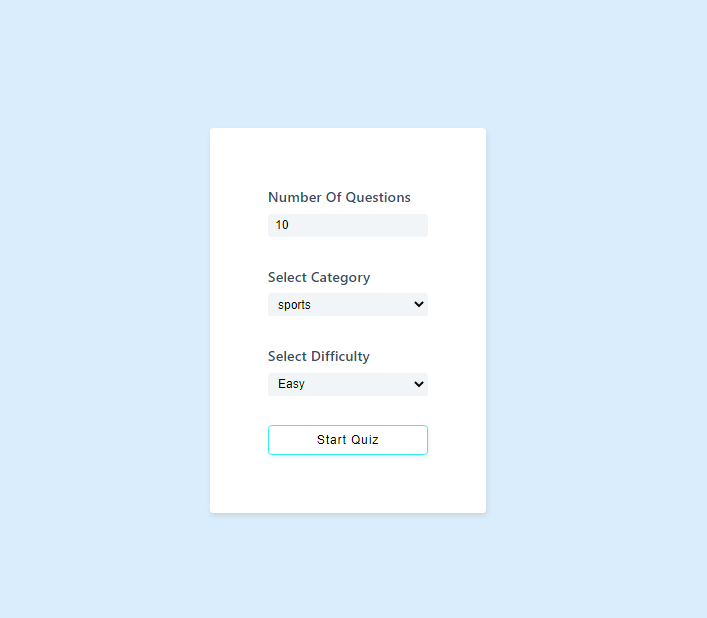
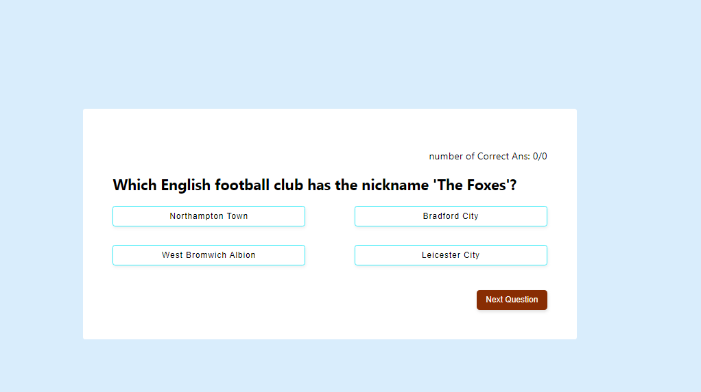
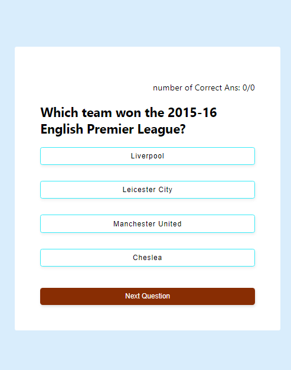

# Quiz-App

Completed the Quiz app using the react library and the trivialdb API,
In this web app user can set the number of questions to answer the category
of questions as well as the difficulties
below shows the image of what is rendered by the quiz app to the browser

# Desktop View

# Mobile view 

